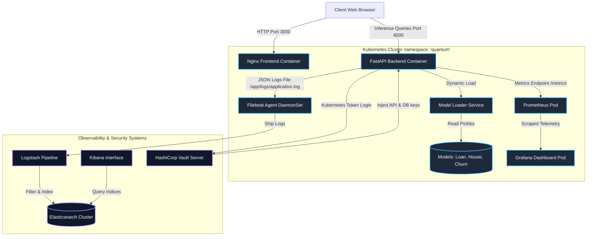
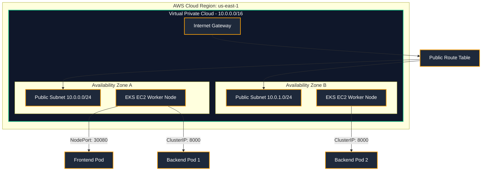

# System Architecture Diagram & Technical Report - Project Quantum

This document provides a comprehensive overview of the design, communication flows, and infrastructure layout for **Project Quantum - Enterprise AI Model Serving Infrastructure**.

---

## 1. System Architecture & Data Flow

The following Mermaid diagram illustrates the request routing path, metrics scrapings, logging collection pipeline, and secret integration paths.

---

## 2. Infrastructure Deployment Topology (AWS & Kubernetes)

The platform is designed to be provisioned via Terraform and orchestrated using AWS EKS across multiple availability zones.

---

## 3. Technology Integrations Overview

* **Inference Gateway**: Built with **FastAPI** for high concurrency and native support for async tasks.
* **Auto-Scaling (HPA)**: Scales inference pods dynamically based on CPU/Memory loads to guarantee throughput.
* **Gateway Observability**:
  * **Prometheus**: Polls `/metrics` every 10 seconds.
  * **Grafana**: Visualizes response times, HTTP statuses, and model toggling states.
* **Structured Auditing**: The application generates structured JSON logs directly to standard output and `application.log`. **Logstash** ingests, parses the JSON structure, and indexes it into **Elasticsearch** for search and dashboards in **Kibana**.
* **Zero-Trust Security**: **HashiCorp Vault** manages sensitive API tokens and database keys. Pods authenticate dynamically using Kubernetes Service Account Tokens.
